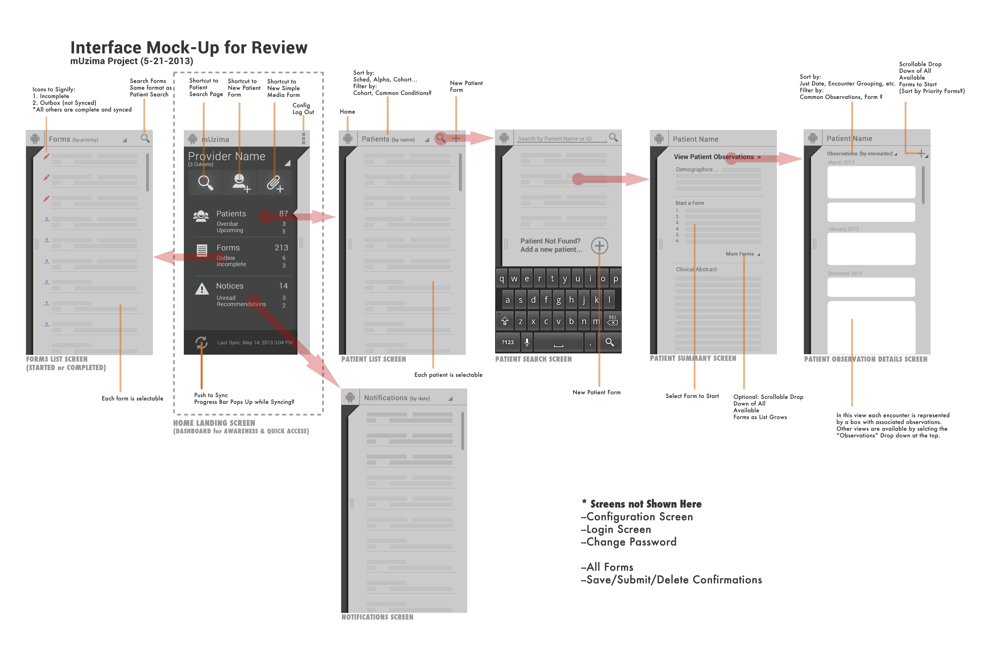

# Interaction Storyboards



An **interaction storyboard** is a sequence of user interface mockups \(sketches, wireframes, etc.\) that show the steps in a task as a user interacts with a website or app.

An interaction storyboard allows the design team to design, test, and revise a website or app _before_ coding it. The designers can try different variations for the screen layouts and quickly make revisions based on feedback from other designers, test users, etc.

Early in the design process, designers typically create screen mockups that are **low-fidelity** sketches or wireframes that just show the basic layout of the user interface – but with limited details and without color. People reviewing low-fidelity mockups tend to provide feedback that focuses more on general features \(because they naturally assume the design is still rough\), such as:

* whether the screen layout makes sense to the user
* whether the user understands the steps to complete tasks

Because it is easier to create low-fidelity mockups, designers can test multiple variations and make revisions until they have sufficient evidence that the general screen layout and task flow makes sense.

As the design process proceeds further, designers typically create screen mockups that are more **high-fidelity** by adding color and details to make the screen look closer to a final version. People reviewing high-fidelity mockups tend to provide feedback that focuses more on details of features \(because they naturally assume the design is closer to complete\), such as:

* whether the user finds the fonts, colors, etc. visually appealing
* whether the user finds the text, images, etc. engaging

However, if your screen layout and task flow don't make sense, it will likely still be apparent even if your screen mockups are high-fidelity – because the users will not understand how to interact with the website or app.



process







[Interface Sketch Templates for Phone, Tablet, and Desktop](https://drive.google.com/open?id=1Xq2I690nLybxSX_k1b0SKzcH40PCmbY3)



