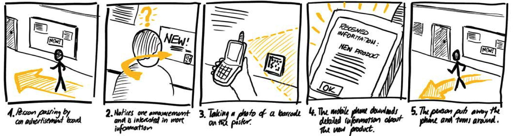

# Narrative Storyboards

A **narrative storyboard** is a series of pictures – similar to a comic strip – that illustrate a brief story.

One common use of narrative storyboards in design is to show a person using a product/service to complete a task in a specific context. The storyboard allows you to show the future user experience of a solution that you've designed.

Another common use of narrative storyboards is to plan out the scenes for a video. For example, you might create a video to demonstrate and explain a design concept or a prototype.

Here's a narrative storyboard showing a person using a QR code app. A person notices an interesting announcement \(maybe for an event or product\) on a bulletin board. The person uses their phone's camera to scan a QR code on the announcement, which downloads details to their phone.

As you can see, a storyboard can use simple drawings and still be quite effective at showing what happens. Each panel also includes a brief description to help clarify what is being shown.

[Narrative Storyboard Template](https://drive.google.com/open?id=1n6FrTVB78Jki2EhqiLCqG2ntqHM-c53E)

## Types of Camera Shots

A storyboard can be more effective if the panels use different types of camera shots depending on what each panel is trying to show, similar to how movies use different camera shots to help tell a story. Some common types of camera shots that are useful in narrative storyboards are shown below.

Your storyboard won’t necessarily use all these camera shots \(and not necessarily in this exact order\). Select and order your camera shots to tell your story in the most effective way possible.

* **Wide shots and long shots** are useful for showing when and where the story takes place and who is involved. They are often used for the first panel to help establish the setting and context.
* **Medium shots** are useful for showing the person’s emotion. They are often used to show a person’s reaction to a problem and/or their reaction to using the solution.
* **Over shoulder shots, point of view shots, and close-up shots** are useful for showing what the person is doing and seeing as the product is being used to complete a task.

## Suggested Storyboard Sequence

Here's a suggested sequence for a 6-panel narrative storyboard that shows what happens before, during, and after a person uses a product/service to complete a specific task:

* **BEFORE** = 2 panels to show problem \(show setting/context and introduce the problem or task that the person needs to solve or complete\)
* **DURING** = 3 panels to show solution \(show the person using the product/service to solve the problem or complete the task\)
* **AFTER** = 1 for panel for benefit \(show how the person feels after using solution\)

The task that you show in a narrative storyboard should be a **primary** task central to the purpose and experience of using your product/service. Do **not** select a secondary task such as: creating an account, logging into the app, etc.  

  

