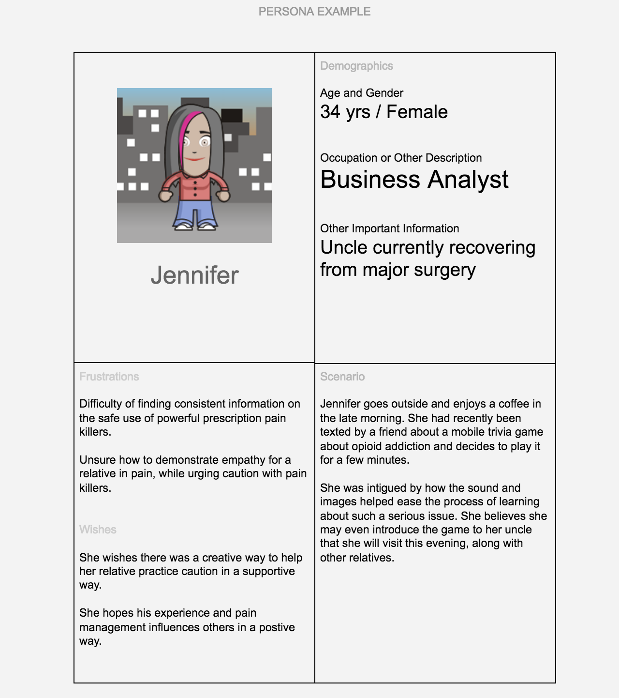
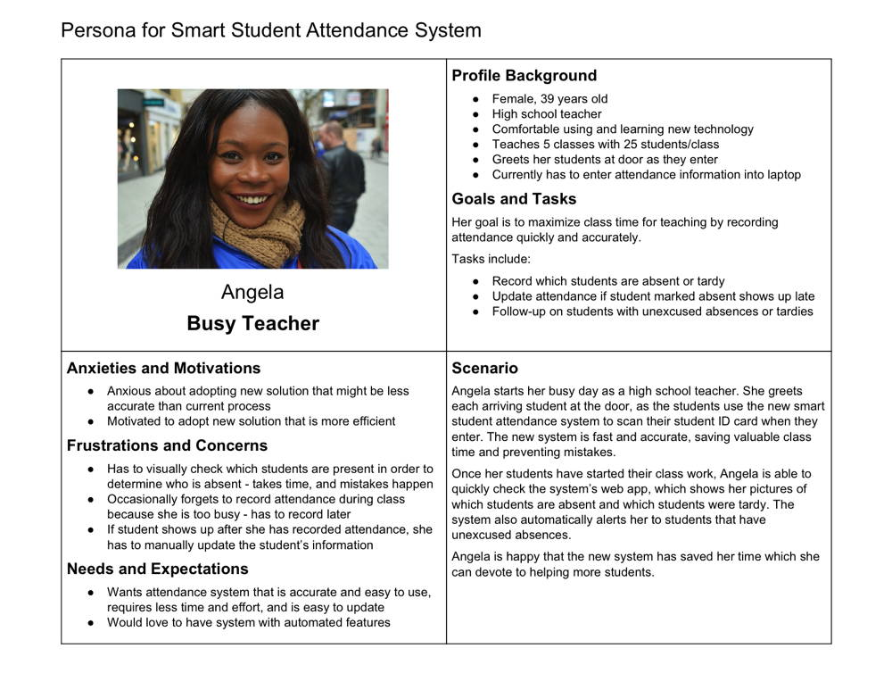

# Personas



A **persona** is a model of a target user for a product or service. A persona summarizes the target user’s background, goals, and needs. The persona helps you better understand your target users, so you can design a solution to meet their needs and expectations.

A persona is based on user research data collected from **multiple** users through observations, interviews, surveys, etc. However, the persona is presented as a description of an individual person, even though the persona actually represents a group of users with similar characteristics.

The reason for presenting the user data as an individual person is because it is easier to empathize with a description of a specific person, rather than a set of statistics summarizing an entire group.

A product or service might have many different types of users with different backgrounds, goals, and needs. Therefore, different personas could be created to model these different types of users.

However, it may not be possible \(or desirable\) to design an solution that tries to meet the needs of every possible type of user. Often this results in a solution that doesn’t actually satisfy anyone. Instead, it is recommended to identify the **primary type of user** that represents your main target for designing your solution.

It is important that a persona is **fictional** \(not an actual individual\) **yet realistic** \(based on data from actual users\). Since one purpose of a persona is to develop empathy for the target users, a persona should NOT be humorous or demeaning.

There are different formats for personas, but personas are usually condensed to one-page in length and often contain information such as:

* **Profile** \(background information about user\):
  * **Photo** \(fictional - use stock photo\)
  * **Name** \(fictional - first name is sufficient\)
  * **Type of User** \(descriptive label or category\)
  * **Relevant Demographic Information** that might affect how product is used or designed \(might include: age, gender, occupation/role, etc.\)
  * **Other Relevant Background Information** that might affect how product is used or designed \(might include: description of physical, social, and technological environment in which product will be used; user’s proficiency with technology; special knowledge or skills; personality traits; etc.\)
* **Goals and Tasks** \(what goals or purpose does user want to achieve when using product, and what tasks does user need to complete with the product in order to meet these goals\)
* **Anxieties and Motivations** \(what influences user’s behaviors and decisions related to adopting possible new solution to meet goals\)
* **Frustrations and Concerns** \(what pain points does user experience with current situation or current solutions\)
* **Needs and Expectations** \(what are user’s expectations related to the functionality, usability, and user experience of possible new solution\)



[Persona Template](https://drive.google.com/open?id=1osCQyHANhkd-mhSi3pqS-eDHLCoJ6HWfLkiK4UPMOkI)

1. Identify types of people that might use your product \(or be affected by its use\). These people might be direct users of the product, or they might be other stakeholders that are interested in how the product performs, data gathered by the product, etc.
2. As a team, develop a standardized set of interview questions that will allow your team to analyze and consolidate the user research data to create a persona:
   1. What **background information** about the person \(age, gender, role, experience, etc.\) might affect how the product is used or designed?
   2. What is the **specific context** \(time, place, etc.\) in which the person would use the product?
   3. What are the **goals and tasks** that the person wants to achieve when using the product?
   4. What are the person's **anxieties or motivations** when selecting a new product?
   5. What are the person’s **frustrations or concerns** with the current situation or products?
   6. What are the person’s **needs or expectations** for a new product?
3. Interview people outside of class that might use \(or be affected by\) your product. It is recommended that each team member interview at least 2 people, so that your team has interviewed at least 5 people or more. Be sure to record notes during each interview.
4. Compile all the team’s user research data into an organized spreadsheet.
5. Analyze and consolidate the team’s user research data to create a persona that represents the characteristics of a typical user \(or stakeholder\) for your product. The persona should also include a **scenario** that briefly explains how the persona would use the product in a specific context.







[Personas Make Users Memorable for Product Team Members](https://www.nngroup.com/articles/persona/) from Nielsen Norman Group



