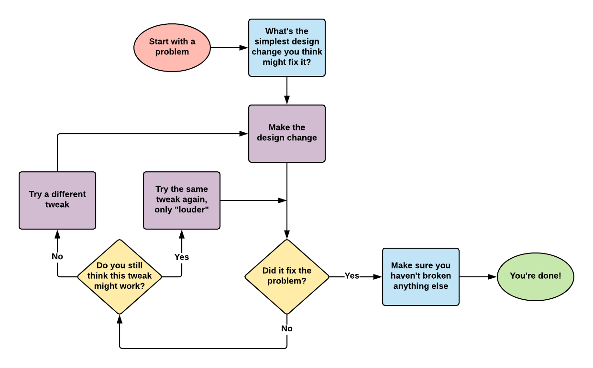

# User Testing \(Usability Testing\)

**User testing \(also called usability testing\)** is a method for testing the usability of a prototype or product by observing users as they try to complete tasks using the prototype/product.

The goal of user testing is to gather data to evaluate whether the prototype/product is easy to understand and use. You'll also determine what changes could be made to the design of the prototype/product to fix any problems that were revealed during user testing.

User testing is helpful throughout design and development. Early in the design process, you could conduct user testing with low-fidelity interface sketches. Later in the design process, you could test a high-fidelity interactive prototype. During and after development, you could conduct user testing with the current version of your product.  Ideally, your team would conduct user testing multiple times as you design and develop your solution.

User testing consists of four major steps:

1. Create Task Scenarios
2. Recruit Participants
3. Facilitate Testing Sessions
4. Summarize Findings

## Create Task Scenarios

1. Identify each task that you want to test with your prototype/product during the session, and determine a logical order for the tasks.
2. Write a brief scenario \(2-4 sentences\) for each task that provides a context \(plus any necessary details\) for completing the task.
3. Print two copies of each task \(one copy for the participant & one copy for your team\). List each task on a separate slip of paper, so you can give the tasks one at a time to the participant.

You'll only be able to test a limited number of tasks during a particular session, so prioritize the most important tasks that should be tested. Depending on how each testing session proceeds, your team might need to skip certain tasks or change the order of the tasks.

The scenario should **not** provide specific steps or any clues for how to complete the task. However, the scenario should provide a context/reason for why the person is trying to complete the task, as well as any detailed information needed to complete the task.

For example, a task for an airline website might be to “book a flight.” The task scenario might be something like:

> You're planning a family vacation to Colorado. You need tickets for 4 people to fly from Indianapolis to Denver. You want to leave on a Saturday in July and come back one week later. Use the website to purchase the least expensive tickets for this trip.

This example task scenario provides a context for the task \(family vacation\) and necessary details \(number of people, departure airport, arrival airport, etc.\) – **without** giving away the specific steps to complete the task.

The task scenario should **avoid** using the same key words that are used in the interface screens of the prototype/product because it will be a direct clue to the participant of what to click or tap. For example, if an airline website has a link or button labeled as “Book a Flight,” the scenario should use a different wording when describing this task, such as:  find flights, reserve a trip, buy tickets, etc.

## Recruit Participants

Recruit 3-5 people \(outside your team\) to be participants that will test your prototype/product.

Ideally, the participants should be similar to your target users and also reflect the diversity \(gender, age, etc.\) of your target user population.  For example, if your product is specifically designed for older users, you shouldn't test it with younger users.  If your product is designed for both women and men, you shouldn't test it with only male users.

During recruiting, let the person know how much time the testing session will require:

* If the person is volunteering their time, you should keep the session brief \(less than 15 minutes\).
* Testing sessions done by companies usually last between 30-60 minutes, so those participants are typically paid for their time.

If you're recruiting people in advance, be sure that the participant knows the exact date, time, and location for the testing session. Send the participant a reminder before his or her session.

## Facilitate Testing Sessions

You’ll conduct an individual testing session for each participant. Be sure you have all your materials ready and organized before the session starts \(e.g., computer or other device for participant to use, printed task scenarios, paper and pencil to record notes, etc.\).

At the start of the session, welcome the participant, and explain the overall testing process:

* The participant will complete a series of tasks using the prototype/product. The participant will have to figure out the specific steps for each task without help from your team.
* The participant should “think aloud” as he or she interacts with the prototype/product, so your team can understand what the person is seeing, doing, and thinking.
* Clarify that the prototype/product is being tested – **not** the participant. Explain that the goal is to gather information to help improve the prototype/product.

Have the participant work on one task at a time. Give the participant a printed copy of the first task scenario, and read it out loud to the participant. As the participant tries to complete the task, your team should observe:

* Your team should record notes describing any problems or issues that you see or hear.  Don't provide any hints or feedback to the participant as they work on the task.
* If necessary, remind the participant to “think aloud” as they work on the task. Because it’s not a natural habit to think out loud, some participants will forget to keep doing it. If the person has stopped talking, you could ask them “What are thinking right now?” to get them talking again.
* If the person asks for help, just remind them that you can’t give them any hints. However, you can clarify the task scenario if it’s unclear. If necessary, remind the participant that the purpose of the session is to learn how someone would try to complete task when no one else is around to help. If necessary, you could redirect them by asking "What do you think the next step should be?"

You should end the task when one of the following has occurred:

* The participant has successfully completed the task.
* The participant believes the task is completed \(even if it isn’t\).
* The participant is confused, frustrated, or unable to complete the task \(and more time won’t help\).

Let the participant know that you’re moving on to the next task. You could say something like “Thank you. That was helpful. Let’s move on to our next task.” Then give the participant the next task scenario, and repeat the previous steps.

Be sure to leave a few minutes at the end of the session for your team to ask any follow-up questions about specific issues that occurred during the testing. It’s better to ask these questions at the end, rather than interrupting the participant during the tasks. This is an opportunity for your team to probe deeper to understand **why** the participant did or said certain things as they interacted with the prototype/product.

Be sure to thank the participant for their time and feedback.

## Summarize Findings

[Evaluation Findings Template](https://drive.google.com/open?id=1Axgyn6N2p7DMMRFWmX5m2AF_ie8GtYJfuW6wQm2K-BI)

Once you’ve tested the prototype/product with each of your 3-5 participants, your team should review and discuss the observations and notes from the sessions, in order to summarize your evaluation findings:

1. Briefly describe each issue that occurred in the testing sessions.
2. Estimate the severity of the issue \(as Low, Medium, or High\).
3. Identify a possible design change that might solve the issue.

[Jakob Nielsen](https://www.nngroup.com/) is a usability expert that recommends rating the severity of usability issues \(as Low, Medium, or High\) based on \(1\) the number of users that are likely to experience the issue, and \(2\) the size of the impact on the user experience. This table shows Nielsen's severity rating matrix:

| SEVERITY RATING | **Few Users Likely to Experience Issue** | **Many Users Likely to Experience Issue** |
| :--- | :--- | :--- |
| **Small Impact on User Experience** | Low | Medium |
| **Large Impact on User Experience** | Medium | High |

[Steve Krug](http://sensible.com/) is a usability expert that recommends a process of tweaking a design to fix problems, rather than completely redesigning something. This diagram shows Krug's process:

As time and resources allow, your team should try to implement the recommended design changes for the most severe issues. If possible, test the revised prototype/product with a new set of participants to verify whether the issues have been resolved.

